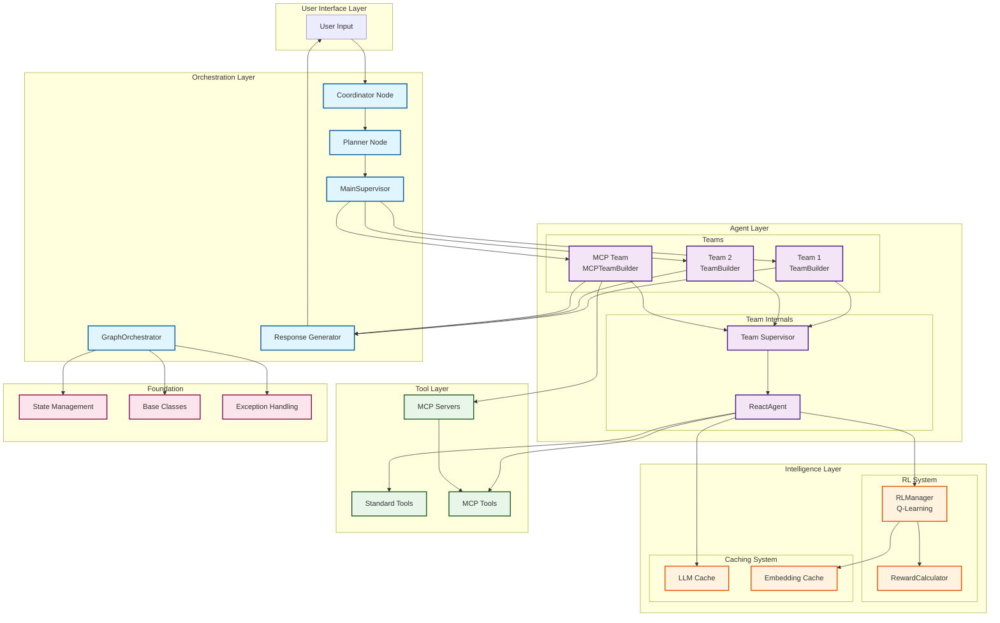
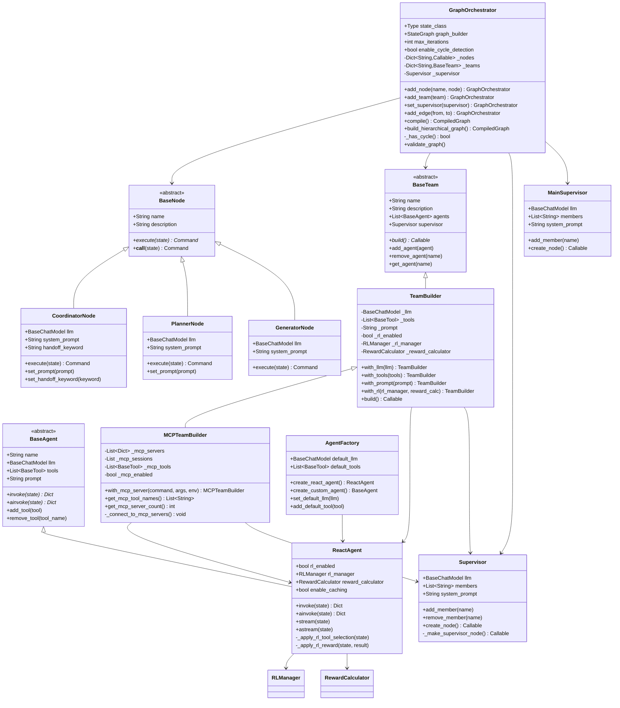
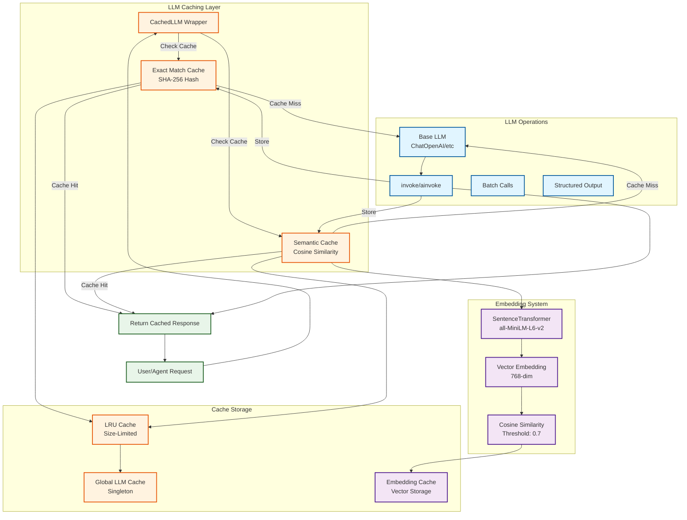
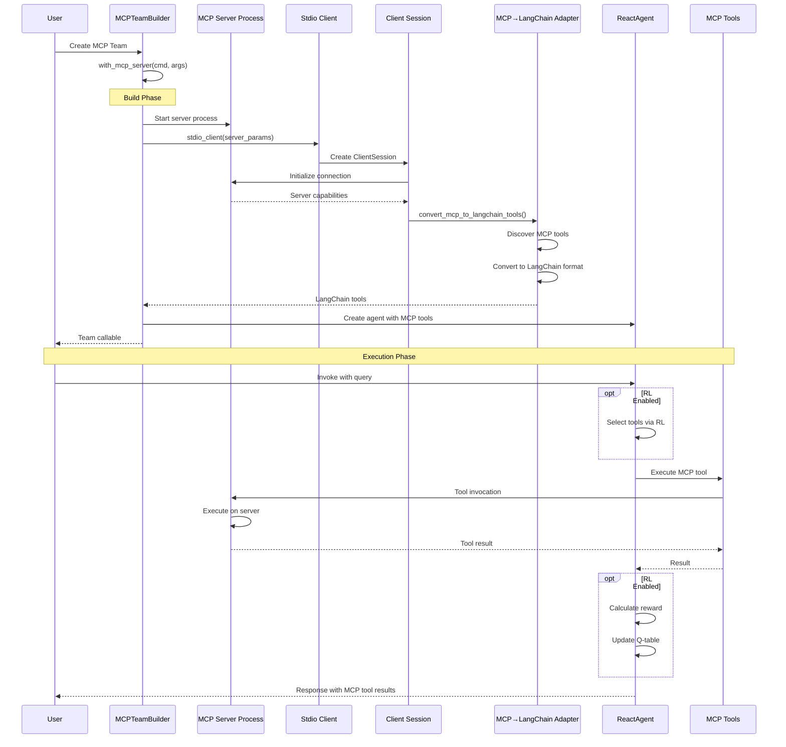
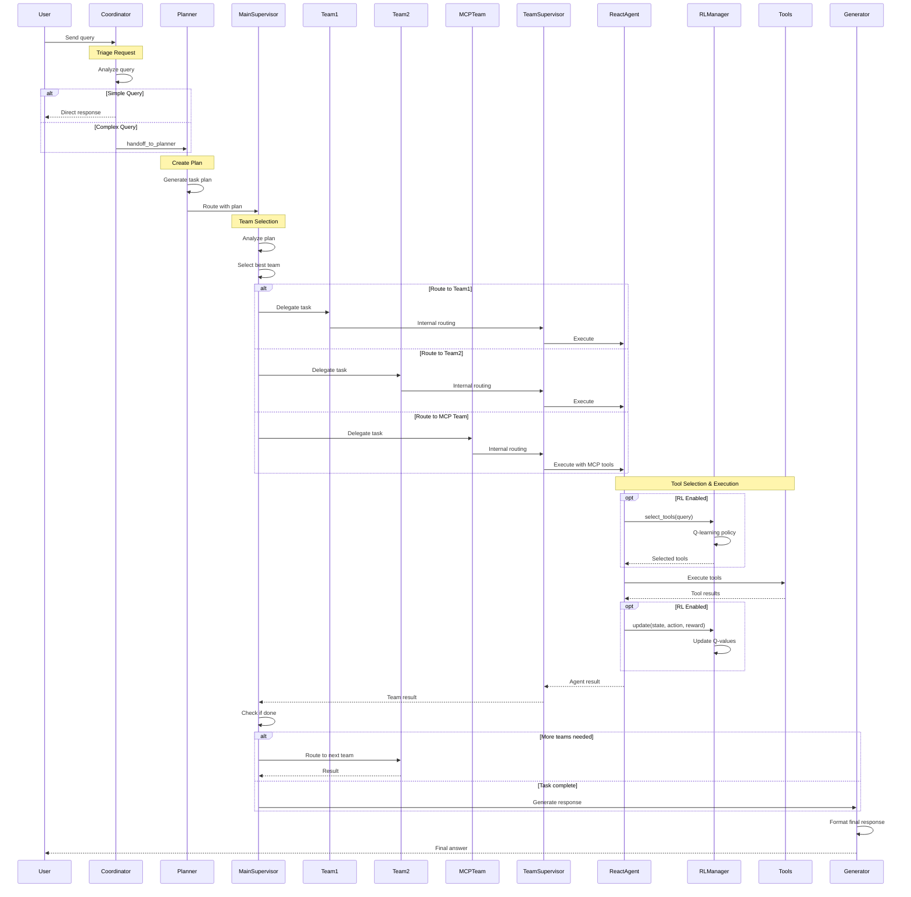
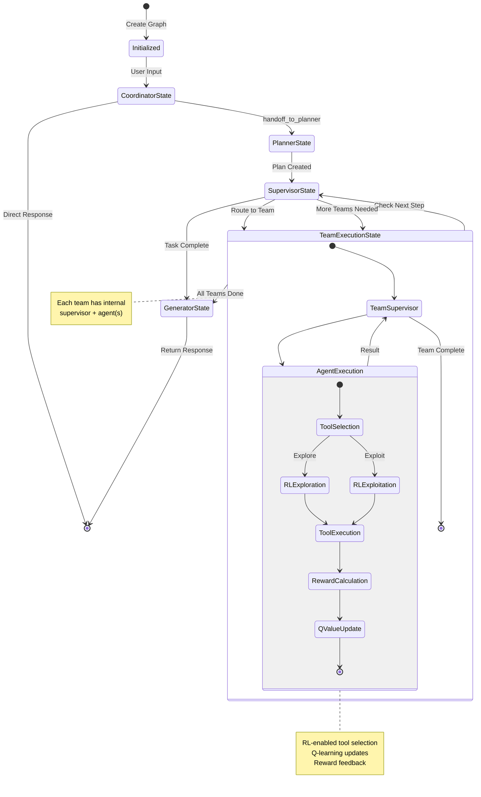
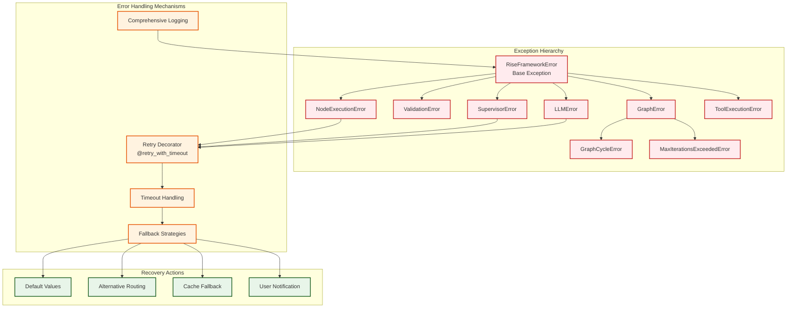
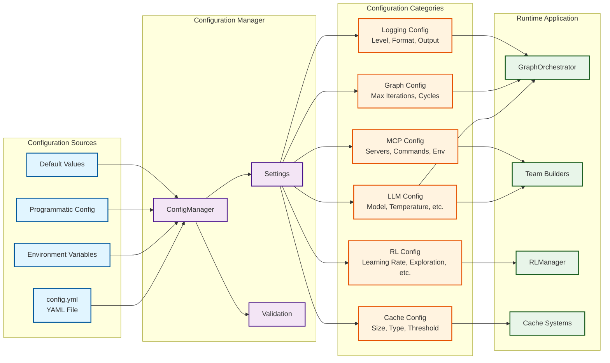

# Arc Framework - Complete Architecture Documentation

## Overview

The Arc Framework is a sophisticated multi-agent orchestration system built on LangGraph, featuring:
- **Hierarchical Agent Teams** with specialized roles
- **Reinforcement Learning** (Q-learning) for intelligent tool selection
- **Model Context Protocol (MCP)** integration for external tool servers
- **LLM Response Caching** for performance optimization
- **Flexible Graph Orchestration** with coordinators, planners, and supervisors

---

## 1. High-Level Architecture



---

## 2. Core Class Hierarchy



---

## 3. Reinforcement Learning System

```mermaid
graph TB
    subgraph "RL Core"
        RLMGR[RLManager<br/>Q-Learning Engine]
        QTABLE[(Q-Table<br/>State-Action Values)]
        EMBEDSTORE[(State Embeddings<br/>Semantic Matching)]
    end
    
    subgraph "Reward System"
        REWARDCALC{RewardCalculator<br/>Abstract}
        HEURISTIC[HeuristicRewardCalculator<br/>Rule-based]
        LLMREWARD[LLMRewardCalculator<br/>LLM-based Scoring]
        USERFEED[UserFeedbackRewardCalculator<br/>Human Feedback]
        COMPOSITE[CompositeRewardCalculator<br/>Weighted Combination]
    end
    
    subgraph "Agent Integration"
        AGENT[ReactAgent]
        TOOLS[Tool Execution]
        RESULT[Execution Result]
    end
    
    subgraph "Learning Process"
        EXPLORE[Exploration<br/>Random Selection]
        EXPLOIT[Exploitation<br/>Best Q-Values]
        UPDATE[Q-Value Update<br/>α, γ, reward]
    end
    
    AGENT -->|1. Query| RLMGR
    RLMGR --> QTABLE
    RLMGR --> EMBEDSTORE
    RLMGR -->|State Matching| EMBEDSTORE
    
    RLMGR -->|2a. Explore?| EXPLORE
    RLMGR -->|2b. Exploit?| EXPLOIT
    
    EXPLORE -->|Random Tools| AGENT
    EXPLOIT -->|Top Q-Value Tools| AGENT
    
    AGENT --> TOOLS
    TOOLS --> RESULT
    
    RESULT -->|3. Calculate Reward| REWARDCALC
    
    REWARDCALC -.-> HEURISTIC
    REWARDCALC -.-> LLMREWARD
    REWARDCALC -.-> USERFEED
    REWARDCALC -.-> COMPOSITE
    
    HEURISTIC -->|Reward Signal| UPDATE
    LLMREWARD -->|Reward Signal| UPDATE
    USERFEED -->|Reward Signal| UPDATE
    COMPOSITE -->|Reward Signal| UPDATE
    
    UPDATE -->|4. Update Q-Values| QTABLE
    UPDATE -->|Q(s,a) = Q(s,a) + α[r + γmax(Q(s',a')) - Q(s,a)]| QTABLE
    
    QTABLE -->|Persist| DISK[(Disk Storage<br/>*.pkl)]
    
    classDef rl fill:#fff3e0,stroke:#e65100,stroke-width:2px
    classDef reward fill:#f3e5f5,stroke:#4a148c,stroke-width:2px
    classDef agent fill:#e1f5ff,stroke:#01579b,stroke-width:2px
    classDef storage fill:#e8f5e9,stroke:#1b5e20,stroke-width:2px
    
    class RLMGR,QTABLE,EMBEDSTORE,EXPLORE,EXPLOIT,UPDATE rl
    class REWARDCALC,HEURISTIC,LLMREWARD,USERFEED,COMPOSITE reward
    class AGENT,TOOLS,RESULT agent
    class DISK storage
```

---

## 4. Caching System Architecture



---

## 5. MCP (Model Context Protocol) Integration



---

## 6. Complete Workflow Sequence



---

## 7. State Management Flow



---

## 8. Error Handling & Exceptions



---

## 9. Configuration & Settings



---

## 10. Complete Module Structure

```mermaid
graph TB
    subgraph "arc Package"
        subgraph "core/"
            BASE_PY[base.py<br/>BaseNode, BaseAgent, BaseTeam]
            STATE_PY[state.py<br/>State TypedDict]
            ORCH_PY[orchestrator.py<br/>GraphOrchestrator]
            SUPER_PY[supervisor.py<br/>Supervisor, MainSupervisor]
            EXEC_PY[agent_executor.py<br/>create_thinkat_agent]
        end
        
        subgraph "agents/"
            FACTORY_PY[agent_factory.py<br/>AgentFactory, ReactAgent]
            TEAM_PY[team_builder.py<br/>TeamBuilder]
            MCP_PY[mcp_team_builder.py<br/>MCPTeamBuilder]
            REACT_PY[react_agent.py<br/>Re-export]
        end
        
        subgraph "nodes/"
            COORD_PY[coordinator.py<br/>CoordinatorNode]
            PLAN_PY[planner.py<br/>PlannerNode]
            GEN_PY[generator.py<br/>GeneratorNode]
        end
        
        subgraph "rl/"
            RLMGR_PY[rl_manager.py<br/>RLManager]
            REWARD_PY[rewards.py<br/>RewardCalculator variants]
        end
        
        subgraph "utils/"
            CACHE_PY[caching.py<br/>LRUCache, SemanticCache]
            CACHED_LLM_PY[cached_llm.py<br/>CachedLLM]
            RETRY_PY[retry.py<br/>@retry_with_timeout]
            LOG_PY[logging.py<br/>Logging setup]
            HELPER_PY[helpers.py<br/>Utility functions]
            DECOR_PY[decorators.py<br/>Decorators]
        end
        
        subgraph "config/"
            CFG_PY[config.py<br/>ConfigManager]
            SETTINGS_PY[settings.py<br/>Settings]
            VALID_PY[validation.py<br/>Validators]
        end
        
        EXCEPT_PY[exceptions.py<br/>Custom Exceptions]
        INIT_PY[__init__.py<br/>Package Exports]
    end
    
    subgraph "External Dependencies"
        LANGGRAPH[LangGraph<br/>StateGraph, Command]
        LANGCHAIN[LangChain<br/>BaseChatModel, Tools]
        MCP_LIB[langchain-mcp-adapters<br/>MCP Integration]
        SENTENCE[sentence-transformers<br/>Embeddings]
    end
    
    BASE_PY --> ORCH_PY
    BASE_PY --> SUPER_PY
    BASE_PY --> COORD_PY
    BASE_PY --> PLAN_PY
    BASE_PY --> GEN_PY
    BASE_PY --> FACTORY_PY
    BASE_PY --> TEAM_PY
    
    STATE_PY --> ORCH_PY
    STATE_PY --> TEAM_PY
    
    EXEC_PY --> FACTORY_PY
    EXEC_PY --> TEAM_PY
    
    SUPER_PY --> ORCH_PY
    SUPER_PY --> TEAM_PY
    
    FACTORY_PY --> TEAM_PY
    TEAM_PY --> MCP_PY
    
    RLMGR_PY --> FACTORY_PY
    REWARD_PY --> FACTORY_PY
    
    CACHE_PY --> CACHED_LLM_PY
    CACHE_PY --> RLMGR_PY
    CACHED_LLM_PY --> FACTORY_PY
    
    RETRY_PY --> COORD_PY
    RETRY_PY --> PLAN_PY
    RETRY_PY --> SUPER_PY
    
    CFG_PY --> SETTINGS_PY
    VALID_PY --> CFG_PY
    
    EXCEPT_PY --> ORCH_PY
    EXCEPT_PY --> SUPER_PY
    EXCEPT_PY --> COORD_PY
    
    LANGGRAPH --> ORCH_PY
    LANGGRAPH --> SUPER_PY
    LANGGRAPH --> TEAM_PY
    
    LANGCHAIN --> BASE_PY
    LANGCHAIN --> FACTORY_PY
    
    MCP_LIB --> MCP_PY
    SENTENCE --> RLMGR_PY
    SENTENCE --> CACHE_PY
    
    classDef core fill:#e1f5ff,stroke:#01579b,stroke-width:2px
    classDef agent fill:#f3e5f5,stroke:#4a148c,stroke-width:2px
    classDef node fill:#fff3e0,stroke:#e65100,stroke-width:2px
    classDef intelligence fill:#ffebee,stroke:#c62828,stroke-width:2px
    classDef util fill:#e8f5e9,stroke:#1b5e20,stroke-width:2px
    classDef config fill:#fce4ec,stroke:#880e4f,stroke-width:2px
    classDef external fill:#f5f5f5,stroke:#424242,stroke-width:2px
    
    class BASE_PY,STATE_PY,ORCH_PY,SUPER_PY,EXEC_PY core
    class FACTORY_PY,TEAM_PY,MCP_PY,REACT_PY agent
    class COORD_PY,PLAN_PY,GEN_PY node
    class RLMGR_PY,REWARD_PY intelligence
    class CACHE_PY,CACHED_LLM_PY,RETRY_PY,LOG_PY,HELPER_PY,DECOR_PY util
    class CFG_PY,SETTINGS_PY,VALID_PY config
    class LANGGRAPH,LANGCHAIN,MCP_LIB,SENTENCE external
```

---

## Summary

The Arc Framework provides a comprehensive, production-ready system for building sophisticated multi-agent applications with:

1. **Modular Architecture**: Clean separation of concerns across layers
2. **Intelligent Optimization**: RL-based tool selection with Q-learning
3. **Performance**: Multi-level caching (LLM responses, embeddings)
4. **Extensibility**: MCP integration for external tool servers
5. **Robustness**: Comprehensive error handling and retry mechanisms
6. **Flexibility**: Fluent builder patterns and hierarchical composition

The framework scales from simple single-agent tasks to complex multi-team orchestrations with automatic learning and optimization.
