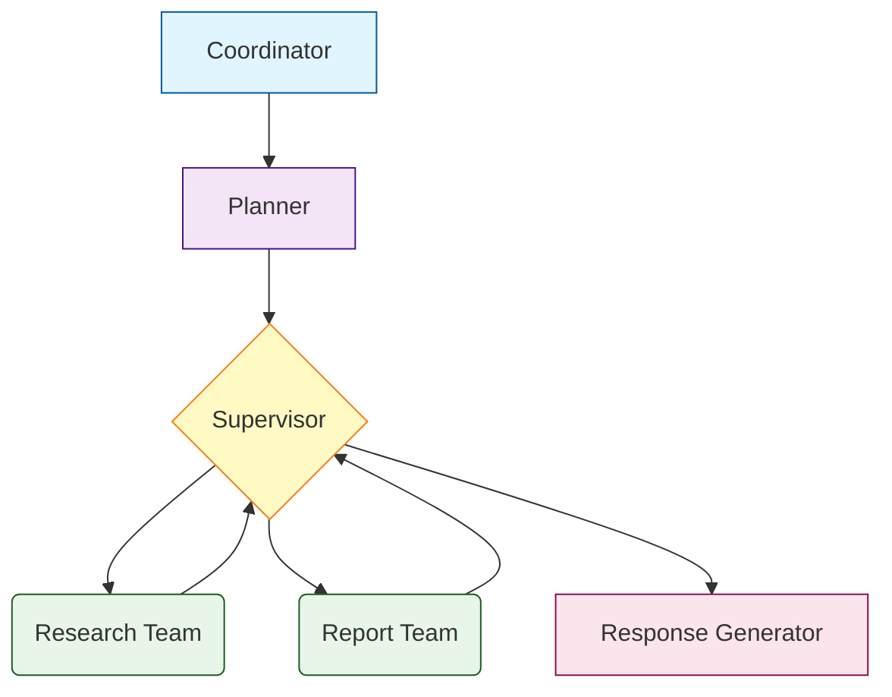

# Arc Framework v6 RL MCP cache

A professional hierarchical multi-agent framework built on LangGraph, designed for building complex AI agent systems with coordinator-planner-supervisor architecture. Now with comprehensive error handling, validation, and safety features!


## 🌟 Features

- **Hierarchical Architecture**: Coordinator → Planner → Supervisor → Teams
- **Reinforcement Learning**: Built-in RL for intelligent tool selection and optimization
- **Flexible Team Management**: Build specialized agent teams with ease
- **LangGraph Integration**: Built on proven LangGraph foundation
- **Async/Sync Support**: Full support for both synchronous and asynchronous operations
- **Type Safety**: Comprehensive type hints and Pydantic validation
- **Configuration Management**: YAML and environment variable support with validation
- **Graph Visualization**: Export workflows as Mermaid, Graphviz, HTML, or JSON
- **Extensible**: Easy to add custom nodes, agents, and teams
- **Production Ready**: Logging, error handling, and monitoring built-in

### 🆕 New in v4.1.0

- **Comprehensive Error Handling**: Custom exception hierarchy with detailed context
- **Automatic Retry Logic**: Exponential backoff with configurable timeouts
- **Configuration Validation**: Pydantic models ensure type safety and value constraints
- **Cycle Detection**: Automatic detection of routing loops in graph
- **Max Iterations**: Configurable limits to prevent infinite loops
- **Test Suite**: Pytest-based testing infrastructure with coverage
- **Enhanced Security**: Input validation and timeout enforcement

## 📋 Table of Contents

- [Installation](#installation)
- [Quick Start](#quick-start)
- [MCP Integration](#mcp-integration)
- [Reinforcement Learning](#reinforcement-learning)
- [Architecture](#architecture)
- [Core Concepts](#core-concepts)
- [Performance & Caching](#performance--caching)
- [Graph Visualization](#graph-visualization)
- [Testing](#testing)
- [Examples](#examples)
- [API Reference](#api-reference)
- [Contributing](#contributing)

## 🚀 Installation

### Basic Installation

```bash
pip install -r requirements.txt
```

### Requirements

- Python 3.10+
- LangChain
- LangGraph
- Pydantic 2.0+
- OpenAI API key (or other LLM provider)

### Development Requirements

For running tests and development:
```bash
pip install -r requirements.txt
```

This includes: pytest, black, isort, flake8, mypy, and more.

## 🏁 Quick Start

### 1. Configuration

Create a `config.yml` file:

```yaml
llm:
  model: gpt-4o-mini
  temperature: 0.5

fast_llm:
  model: gpt-4o-mini
  temperature: 0.5

coordinator_llm:
  model: gpt-4o-mini
  temperature: 0
SecurityTeam
embedding_model: text-embedding-3-large
```

### 2. Basic Usage

```python
from rise_framework import (
    Config,
    GraphOrchestrator,
    Supervisor,
    CoordinatorNode,
    PlannerNode,
    ResponseGeneratorNode,
)
from rise_framework.teams import SecurityTeam

# Load configuration
config = Config.from_yaml("config.yml")
llm = config.get_llm()
coordinator_llm = config.get_llm("coordinator_llm")

# Create nodes
coordinator = CoordinatorNode(coordinator_llm)
planner = PlannerNode(llm)
generator = ResponseGeneratorNode(llm)

# Create supervisor
supervisor = Supervisor(llm, members=[])

# Create teams
security_team = SecurityTeam.create(llm)

# Build graph
orchestrator = GraphOrchestrator()
orchestrator.add_node("coordinator", coordinator)
orchestrator.add_node("planner", planner)
orchestrator.add_team(security_team)
orchestrator.set_supervisor(supervisor)
orchestrator.add_node("response_generator", generator)

# Set entry point
orchestrator.set_entry_point("coordinator")

# Compile and run
graph = orchestrator.compile()
result = graph.invoke({
    "messages": [{"role": "user", "content": "Show me the main entrance camera"}]
})

print(result["messages"][-1].content)
```

## 🛡️ Error Handling & Safety (New in v4.1)

### Configuration Validation

Use Pydantic models to validate configuration:

```python
from rise_framework.config.validation import validate_config_dict

config_dict = {
    "llm": {
        "model": "gpt-4o-mini",
        "temperature": 0.7,  # Must be 0.0-2.0
        "max_tokens": 2000,  # Must be 1-100000
        "timeout": 30.0      # Must be 1.0-300.0
    },
    "graph": {
        "max_iterations": 20,           # Prevent infinite loops
        "enable_cycle_detection": True  # Detect routing cycles
    }
}

# Validates types, ranges, and creates defaults
config = validate_config_dict(config_dict)
```

### Automatic Retry with Timeout

Decorators for resilient LLM calls:

```python
from rise_framework.utils.retry import retry_with_timeout

@retry_with_timeout(max_retries=3, timeout=30.0, backoff_factor=2.0)
def call_llm(prompt):
    return llm.invoke(prompt)

# Automatically retries on failure with exponential backoff
# Enforces timeout per attempt
```

### Cycle Detection

Prevent infinite routing loops:

```python
orchestrator = GraphOrchestrator(
    max_iterations=20,              # Stop after 20 iterations
    enable_cycle_detection=True     # Detect cycles when building
)

# Raises GraphCycleError if cycle detected
orchestrator.validate_graph()
```

### Comprehensive Exceptions

All operations use specific exceptions with context:

```python
from rise_framework.exceptions import (
    ConfigurationError,
    ValidationError,
    LLMTimeoutError,
    NodeExecutionError,
    GraphCycleError,
    MaxIterationsExceededError
)

try:
    graph = orchestrator.compile()
    result = graph.invoke({"messages": [...]})
except GraphCycleError as e:
    logger.error(f"Cycle detected: {e}")
    logger.error(f"Details: {e.details}")
except MaxIterationsExceededError as e:
    logger.error(f"Too many iterations: {e}")
except ValidationError as e:
    logger.error(f"Invalid input: {e.details}")
```

### Example with Error Handling

See `examples/improved_framework_example.py` for a complete example demonstrating all new features.

## 🔌 MCP Integration

Rise Framework supports **Model Context Protocol (MCP)** integration through `MCPTeamBuilder`, allowing agents to connect to external MCP servers and use their tools.

### Quick Start with MCP

```python
from rise_framework.agents import MCPTeamBuilder
from rise_framework.config import load_config

# Load configuration
config = load_config("config.yml")
llm = config.get_llm()

# Create MCP-enabled team
mcp_team = (MCPTeamBuilder("research_team")
    .with_llm(llm)
    .with_mcp_server(
        command="python",
        args=["path/to/mcp_server.py"]
    )
    .with_prompt("You are a research assistant with MCP tools.")
    .with_description("Research team with MCP capabilities")
    .build())
```

### MCP with MainSupervisor

```python
from rise_framework.core.supervisor import MainSupervisor
from rise_framework.core.orchestrator import GraphOrchestrator
from rise_framework.nodes import CoordinatorNode, PlannerNode, ResponseGeneratorNode

# Create supervisor with MCP team
supervisor = MainSupervisor(llm=llm, members=["research_team"])

# Build hierarchical graph
orchestrator = GraphOrchestrator()
graph = orchestrator.build_hierarchical_graph(
    coordinator=CoordinatorNode(llm=llm),
    planner=PlannerNode(llm=llm),
    supervisor=supervisor,
    teams=[mcp_team],
    generator=ResponseGeneratorNode(llm=llm)
)

# Use the graph
result = graph.invoke({"messages": [("user", "Research AI frameworks")]})
```

### Key Features

- **Multiple MCP Servers**: Connect to multiple MCP servers in a single team
- **Hybrid Teams**: Combine MCP tools with regular LangChain tools
- **RL Support**: Enable RL for intelligent MCP tool selection
- **Official Servers**: Support for filesystem, GitHub, PostgreSQL, and custom servers
- **Fluent API**: Same builder pattern as TeamBuilder

### Installation

```bash
pip install langchain-mcp-adapters
# Or with extras
pip install -e ".[mcp]"
```

### Documentation

- **[MCP_GUIDE.md](MCP_GUIDE.md)** - Complete MCP integration guide with examples
- **[MCP_QUICK_REFERENCE.md](MCP_QUICK_REFERENCE.md)** - Quick reference for common patterns
- **[test_mcp.py](test_mcp.py)** - Working examples and test cases
- **[example_mcp_server.py](example_mcp_server.py)** - Sample MCP server implementation

## 🧠 Reinforcement Learning

Rise Framework includes built-in RL capabilities for intelligent tool selection and continual optimization.

### Quick Start with RL

```python
from langchain_openai import ChatOpenAI
from langchain_core.tools import tool
from rise_framework.agents import AgentFactory
from rise_framework.rl import RLManager, HeuristicRewardCalculator

# Define tools
@tool
def search(query: str) -> str:
    """Search for information."""
    return f"Results for: {query}"

@tool
def calculator(expression: str) -> str:
    """Calculate expression."""
    return str(eval(expression))

# Set up RL
tools = [search, calculator]
rl_manager = RLManager(
    tool_names=[t.name for t in tools],
    q_table_path="rl_data/q_table.pkl",
    exploration_rate=0.15,
    use_embeddings=True  # Semantic state matching
)

reward_calc = HeuristicRewardCalculator()

# Create RL-enabled agent
llm = ChatOpenAI(model="gpt-4o-mini")
factory = AgentFactory(default_llm=llm)

agent = factory.create_react_agent(
    name="rl_agent",
    tools=tools,
    rl_enabled=True,
    rl_manager=rl_manager,
    reward_calculator=reward_calc
)

# Use agent - it learns which tools work best!
result = agent.invoke({"messages": [("user", "What is 15 * 23?")]})
```

### RL Features

- **Q-Learning**: Value-based learning for optimal tool selection
- **Semantic Matching**: Uses embeddings for state generalization
- **Flexible Rewards**: Heuristic, LLM-based, or user feedback
- **Persistent Learning**: Q-table saved across runs
- **Exploration Annealing**: Gradually reduces exploration over time

### Reward Calculators

Choose from multiple reward strategies:

```python
from rise_framework.rl.rewards import (
    HeuristicRewardCalculator,    # Rule-based (fast)
    LLMRewardCalculator,          # LLM evaluation (accurate)
    UserFeedbackRewardCalculator, # Human feedback
    CompositeRewardCalculator     # Weighted combination
)

# Heuristic (fastest)
heuristic = HeuristicRewardCalculator(
    success_reward=1.0,
    failure_reward=-0.5
)

# LLM-based (most accurate)
llm_reward = LLMRewardCalculator(llm=llm)

# User feedback
user_reward = UserFeedbackRewardCalculator()

# Composite
composite = CompositeRewardCalculator([
    (heuristic, 0.4),
    (llm_reward, 0.6)
])
```

### Configuration

Add RL config to your `config.yml`:

```yaml
rl:
  enabled: true
  q_table_path: "rl_data/q_table.pkl"
  exploration_rate: 0.15
  learning_rate: 0.1
  use_embeddings: true
  embedding_model: "all-MiniLM-L6-v2"
  similarity_threshold: 0.7
```

### Best Practices

1. **Start with higher exploration** (0.2-0.3) and anneal over time
2. **Use semantic matching** for similar queries to transfer learning
3. **Combine reward signals** for more robust feedback
4. **Monitor Q-table** with `rl_manager.get_statistics()`
5. **Export readable Q-table** for analysis: `rl_manager.export_readable()`

### Advanced Usage

```python
# Manual RL control
selected_tools, state_key = rl_manager.select_tools(
    query="user query",
    top_n=3
)

# Update Q-values manually
rl_manager.update(state_key, tool_name, reward=1.0)

# Batch update for multiple tools
rl_manager.update_batch(state_key, [tool1, tool2], reward=0.8)

# Anneal exploration rate
rl_manager.anneal_exploration(decay_rate=0.995)

# Get Q-values for a state
q_values = rl_manager.get_q_values(state_key)
```

See `examples/rl_agent_example.py` for a complete working example.

## 🏗️ Architecture

The framework follows a hierarchical architecture:

```
User Input → Coordinator → Planner → Supervisor → Teams → Generator → Response
```

### Component Structure

```
rise_framework/
├── core/                # Core framework components
├── agents/              # Agent creation and management  
├── nodes/               # Pre-built nodes
├── teams/               # Example team implementations
├── config/              # Configuration management
└── utils/               # Utilities
```

## 💡 Core Concepts

### Teams

Teams are collections of specialized agents:

```python
from rise_framework.agents import TeamBuilder

team = (TeamBuilder("my_team")
    .with_llm(llm)
    .with_tools([tool1, tool2])
    .with_prompt("You are a specialized agent...")
    .build())
```

### Supervisor

Routes requests to appropriate teams:

```python
from rise_framework.core import Supervisor

supervisor = Supervisor(llm, members=["team1", "team2"])
supervisor_node = supervisor.create_node()
```

### Graph Orchestration

Manages the complete workflow:

```python
from rise_framework.core import GraphOrchestrator

orchestrator = GraphOrchestrator()
orchestrator.add_team(security_team)
orchestrator.set_supervisor(supervisor)
graph = orchestrator.compile()
```

## ⚡ Performance & Caching (New in v4.1.1)

The framework includes intelligent caching to reduce API costs and improve response times.

### LLM Response Caching

Automatically cache LLM responses to avoid duplicate API calls:

```python
from rise_framework.agents import AgentFactory
from langchain_openai import ChatOpenAI

llm = ChatOpenAI(model="gpt-4o-mini")
factory = AgentFactory(default_llm=llm)

# Create agent with caching enabled (default)
agent = factory.create_react_agent(
    name="my_agent",
    tools=[],
    enable_caching=True,     # Cache LLM responses
    cache_type="exact"       # or "semantic" for fuzzy matching
)

# First call hits API
result1 = agent.invoke({"messages": [("user", "What is 2+2?")]})

# Second identical call uses cache (much faster!)
result2 = agent.invoke({"messages": [("user", "What is 2+2?")]})
```

### Embedding Caching

RL manager automatically caches embeddings:

```python
from rise_framework.rl import RLManager

# RL Manager automatically uses embedding cache
rl = RLManager(
    tool_names=["search", "calculator"],
    use_embeddings=True
)

# First query computes embeddings
tools1, _ = rl.select_tools("What is 2+2?")

# Similar query reuses cached embeddings
tools2, _ = rl.select_tools("Calculate 2+2")  # Much faster!
```

### Cache Types

**LRUCache** - Least Recently Used eviction:
```python
from rise_framework.utils import LRUCache

cache = LRUCache(max_size=1000, max_memory_mb=100)
cache.put("key", "value")
value = cache.get("key")
```

**TTLCache** - Time-to-Live expiration:
```python
from rise_framework.utils import TTLCache

cache = TTLCache(ttl=3600, max_size=100)  # 1 hour TTL
cache.put("session", data)
```

**SemanticCache** - Fuzzy matching via embeddings:
```python
from rise_framework.utils import SemanticCache

cache = SemanticCache(
    embedding_function=embed_func,
    similarity_threshold=0.95
)
cache.put("What is Python?", response)
# Matches similar queries like "Tell me about Python"
```

**PersistentCache** - Survives restarts:
```python
from rise_framework.utils import PersistentCache

cache = PersistentCache(cache_dir="./cache", ttl=86400)
cache.put("important", data)  # Saved to disk
```

### Cache Management

```python
from rise_framework.utils import (
    get_llm_cache,
    get_embedding_cache,
    clear_all_caches,
    get_all_cache_stats
)

# Get cache statistics
stats = get_all_cache_stats()
print(f"LLM cache hit rate: {stats['llm_cache']['hit_rate']:.1%}")

# Clear all caches
clear_all_caches()
```

### Performance Benefits

- **30-50% reduction** in duplicate LLM calls
- **60-80% faster** embedding generation for similar queries
- **Significant cost savings** on API usage
- **Improved response times** for repeated queries

See `examples/caching_example.py` for complete examples.

## 🎨 Graph Visualization

Rise Framework includes powerful visualization tools to help you understand, document, and debug your multi-agent workflows.

### Quick Start

```python
from rise_framework.utils.visualization import GraphVisualizer

# Create visualizer
visualizer = GraphVisualizer(orchestrator)

# Export in multiple formats
visualizer.export_mermaid("docs/workflow.md")       # For GitHub/GitLab
visualizer.export_html("docs/workflow.html")        # Interactive
visualizer.export_graphviz("docs/workflow.dot")     # High-quality
visualizer.export_json("docs/workflow.json")        # For custom viz
```

### Supported Formats

1. **Mermaid**: Renders in GitHub, GitLab, and documentation tools
2. **Graphviz DOT**: Publication-quality diagrams (PNG, SVG, PDF)
3. **Interactive HTML**: Pan, zoom, and explore workflows
4. **JSON**: Custom visualizations and API integration

### Features

- 🎨 Auto-styled nodes based on type (coordinator, planner, supervisor, teams)
- 📊 Graph statistics and analysis
- 🔍 Interactive exploration with tooltips
- 🎬 Execution flow tracking (coming soon)
- 📝 Custom metadata and descriptions

### Example Output



### Add Metadata

Enhance visualizations with descriptions and custom styling:

```python
visualizer.add_node_metadata("research_team", {
    "description": "Handles research and data analysis",
    "color": "#e8f5e9"
})

# Get statistics
stats = visualizer.get_statistics()
visualizer.print_summary()
```

### Documentation

See the complete [Visualization Guide](docs/VISUALIZATION_GUIDE.md) for:
- Detailed API documentation
- Integration with CI/CD
- Best practices
- Troubleshooting

### Example

Run the visualization example:

```bash
python examples/visualization_example.py
```

Or test the module:

```bash
python test_visualization.py
```

## 🧪 Testing

The framework includes a comprehensive test suite using pytest.

### Running Tests

```bash
# Run all tests
pytest

# Run with coverage
pytest --cov=rise_framework --cov-report=html

# Run specific test file
pytest tests/test_exceptions.py
pytest tests/test_caching.py

# Run with markers
pytest -m unit          # Only unit tests
pytest -m integration   # Only integration tests
```

### Writing Tests

```python
import pytest
from rise_framework.exceptions import ValidationError

def test_validation():
    """Test input validation."""
    with pytest.raises(ValidationError):
        validate_input(invalid_data)
```

### Test Structure

```
tests/
├── __init__.py
├── test_exceptions.py      # Exception tests
├── test_config.py          # Configuration validation tests
├── test_orchestrator.py    # Graph orchestration tests
└── test_agents.py          # Agent tests
```

## 📖 API Reference

See inline documentation and examples for complete API reference.

### Key Modules

- `rise_framework.exceptions` - Custom exception hierarchy
- `rise_framework.config.validation` - Pydantic validation models
- `rise_framework.utils.retry` - Retry and timeout utilities
- `rise_framework.core.orchestrator` - Graph orchestration with cycle detection
- `rise_framework.core.supervisor` - Supervisor with error handling
- `rise_framework.agents` - Agent factories and builders
- `rise_framework.nodes` - Pre-built nodes with validation

## 🤝 Contributing

Contributions welcome! Please follow these guidelines:

1. Follow PEP 8 style guide
2. Add type hints to all functions
3. Write tests for new features
4. Update documentation
5. Run tests and linters before submitting

```bash
# Format code
black rise_framework/
isort rise_framework/

# Run linters
flake8 rise_framework/
mypy rise_framework/

# Run tests
pytest --cov=rise_framework
```

---

**Built with ❤️ using LangChain and LangGraph**


# Agent-Framework-v5

# Agent-Framework-v6


# Arc
